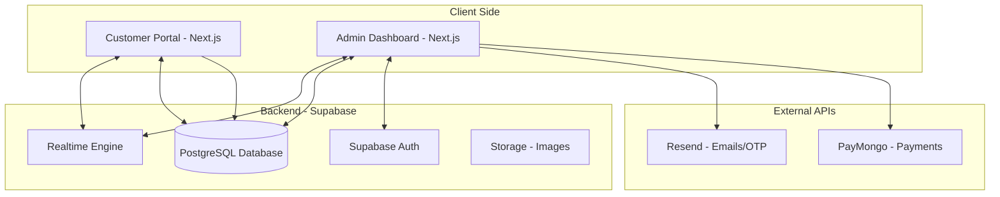

# Salon System: Thesis Defense Toolkit

This toolkit is designed to help you prepare for your final project defense. It summarizes the technical complexities, business logic, and architectural decisions of the **Salon Management System**.

---

## 1. Project Abstract
The **Salon Management System** is a unified, dual-portal platform (Customer & Admin) designed to modernize salon operations. It replaces manual booking and record-keeping with an automated, real-time solution. Key features include an interactive booking calendar, integrated payment processing via PayMongo, real-time administrative notifications, and comprehensive inventory/staff management.

---

## 2. Technical Stack Highlights
*Be prepared to explain **why** you chose these technologies.*

| Technology | Role | Rationale for Defense |
| :--- | :--- | :--- |
| **Next.js (React)** | Frontend Framework | Enables fast, SEO-friendly performance and a modular component architecture. |
| **Supabase** | Backend-as-a-Service | Provides a robust PostgreSQL database, built-in Authentication, and **Realtime** capabilities (crucial for instant updates). |
| **TypeScript** | Programming Language | Ensures type safety, reducing runtime errors and improving codebase maintainability—essential for "enterprise-grade" feel. |
| **PayMongo API** | Payment Gateway | Demonstrates integration with a local, professional payment provider for seamless digital transactions. |
| **Resend API** | Email Service | Used for automated booking confirmations and OTP delivery, showing professional external API integration. |
| **Vanilla CSS** | Styling | Shows deep understanding of CSS fundamentals and full control over a premium, branded UI/UX without relying on heavy frameworks. |

---

## 3. API Integrations & Functions
*If asked: "What are the specific functions of each external API you used?"*

| API | Core Function | Specific Usage in System |
| :--- | :--- | :--- |
| **Supabase (PostgreSQL)** | Data Persistence | Stores all relational data including appointments, customer records, inventory, and staff schedules. |
| **Supabase (Auth)** | User Security | Manages administrator login sessions and secure token handling. |
| **Supabase (Realtime)** | Live Communication | Listens for database changes and broadcasts instant notifications to the Admin Dashboard (WebSockets). |
| **PayMongo API** | Payment Processing | Generates checkout links and handles secure credit card/e-wallet transactions for salon services. |
| **Resend API** | Communication | Automates the delivery of booking confirmation emails and secures the login process via **Email OTP** codes. |

---

## 3. Key Technical "Wins" (The "Wow" Factors)
*Highlight these during your demo to show technical depth.*

1.  **Real-Time Synchronization**: Using Supabase Realtime, the Admin Dashboard receives booking notifications instantly without page refreshes.
2.  **Secure Admin Authentication**: Implemented a custom **OTP (One-Time Password)** system via email for administrative access, adding a layer of security beyond simple passwords.
3.  **Automated Billing Workflow**: The system automatically generates billing records from appointments and allows for seamless status transitions (Pending -> Paid).
4.  **Dynamic Portfolio**: A specialized "Nail Designs" module with JSONB storage for complex design attributes (shape, texture, colors).

---

## 4. Software Development Methodology: Agile Iterative
*If asked: "Why Agile Iterative and not Waterfall?"*

**Core Answer:** 
"I chose the **Agile Iterative** methodology because it allowed for continuous refinement of the system's complex features. Unlike the Waterfall model, which requires all requirements to be finalized at the start, Agile allowed me to build, test, and improve the system in cycles."

**Key Justifications:**
1.  **Requirement Evolution**: As I integrated external APIs like **PayMongo** and **Resend**, I discovered new technical requirements. Agile allowed me to pivot and adjust the logic without restarting the entire development process.
2.  **Early Risk Mitigation**: Complex features like **Supabase Realtime** notifications were developed and tested in early iterations. This ensured that the most difficult technical hurdles were cleared long before the final deadline.
3.  **Continuous Feedback**: By developing the system in iterations, I could constantly review the UI/UX of both the Admin and Customer portals, ensuring they remained synchronized and user-friendly.
4.  **Tangible Progress**: In each 'sprint', a functional part of the system (e.g., the booking calendar or the inventory list) was completed, which provided a sense of progress and reduced the risk of 'big bang' failures at the end of the project.

---

## 5. Anticipated Panel Questions & Answers

### A. Database & Architecture
**Q: Why did you use PostgreSQL (Supabase) instead of a NoSQL database like MongoDB?**
**A:** "For a Salon System, data integrity and relationships are critical. Appointments must be strictly linked to Customers, Services, and Staff. PostgreSQL's relational nature and Foreign Key constraints ensure that we don't have 'orphan' bookings or inconsistent data."

**Q: What is the purpose of the `profiles` table vs the `customers` table?**
**A:** "The `profiles` table is for internal users (Administrators/Staff) linked to Supabase Auth, while the `customers` table is for client records. This separation allows us to track detailed customer history (visits, total spent) independently of system access credentials."

**Q: In your code, you calculate `total_spent` and `visits` dynamically in the `Customers.list()` function instead of storing them as static values. Why?**
**A:** "This approach ensures **data consistency**. If we stored these values as static columns, they might fall out of sync if an appointment is deleted or updated. By aggregating them dynamically from the `appointments` table, we guarantee that the dashboard always reflects the true, real-time status of each customer's history."

### B. Security & Authentication
**Q: How do you secure the Admin Dashboard?**
**A:** "We use a multi-layered approach: Supabase Auth for standard login, coupled with a custom **Email OTP** system stored in the `admin_otps` table. This ensures that even if a password is compromised, access requires access to the verified administrator email."

### C. Functionality
**Q: How does the system handle conflicting appointments?**
**A:** "The system uses a 'Pending' status for all new online bookings. This allows the Administrator to review the request against the real-world availability of staff before approving. Once approved, the status changes to 'Scheduled', and the system marks that slot as occupied in the customer view."

---

## 5. System Demonstration Script (The "Perfect Demo")

1.  **Introduction (1 min)**: Show the Customer Portal home page. Highlight the premium branding and "Service Menu".
2.  **The Booking Flow (2 mins)**:
    *   Navigate to "Book Now".
    *   Select a Service and a Nail Design.
    *   Pick a date/time.
    *   **Crucial**: Show the "Pending" success message.
3.  **The Admin Interception (2 mins)**:
    *   Switch to the Admin Dashboard.
    *   Show the **Real-time Notification** appearing instantly.
    *   Navigate to "Appointments" and view the "Pending" request.
    *   Click "Approve" (Explain that this triggers the Resend email).
4.  **Billing & Settlement (1 min)**:
    *   Show the appointment moving to "Completed".
    *   Go to "Billing" and show the auto-generated invoice for that customer.
5.  **Management Overview (1 min)**:
    *   Briefly show "Inventory" (Low stock alerts).
    *   Briefly show "Staff Attendance".
6.  **Conclusion**: Final summary of how this solves real-world salon problems.

---

## 6. Technical Architecture Diagram

---
**Tip**: When the panel asks a difficult question, take a breath, relate it back to your **Data Dictionary** or **Database Schema**, and explain your logic clearly! Good luck!
