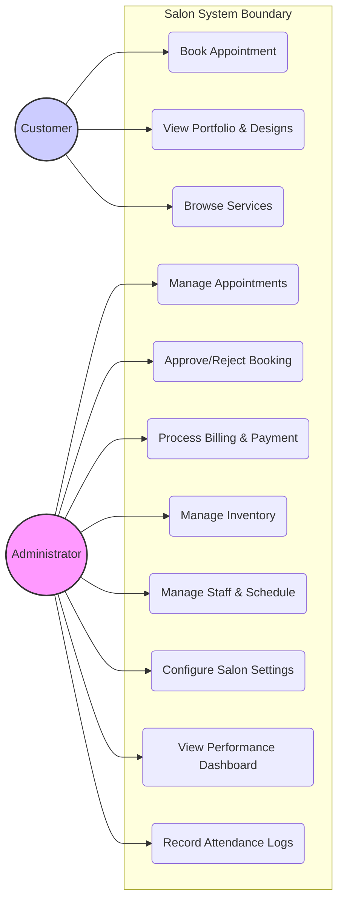

# Salon System Use Case Diagram

This diagram illustrates the interactions between the primary actors and the Salon System.

## Diagram Description

The Use Case Diagram presented below delineates the functional requirements and interactive boundaries of the **Salon Management System**. It provides a high-level abstraction of the system's behavioral specifications, illustrating the symbiotic relationship between the primary actors—the **Customer** and the **Administrator**—and the core system modules. Each use case represents a distinct functional unit, ranging from client-facing booking requests to complex administrative oversight such as financial reconciliation and inventory management. The subsequent narrative sections provide an in-depth analysis of the operational workflows, tracing the sequence of interactions that occur as actors engage with the platform to achieve specific business objectives. This formal mapping serves as a critical analytical tool for validating that the system’s design accurately fulfills the identified user requirements and operational logic.

### Actors
1.  **Customer**: The external stakeholder who interacts with the `salon-customer` interface to query service offerings, engage with the visual portfolio, and initiate appointment protocols.
2.  **Administrator**: The internal supervisory actor responsible for the comprehensive governance of the `salon-dashboard`, possessing the authority to manage personnel, calibrate system configurations, and oversee the fiscal and material health of the salon.

---

## Operational Workflows (System Flows)

### Appointment Lifecycle Management
The appointment lifecycle is initiated when a Customer accesses the portal to perform a comparative analysis of services and curated nail design aesthetics. Upon selecting a preferred service and temporal slot, the actor submits a formal request, which is immediately broadcast to the Administrator's management interface. The Administrator performs an evaluative review of the request, determining whether to authorize or decline the booking based on the current resource availability and personnel scheduling. Upon authorization, the system transitions the record to a confirmed state and facilitates the assignment of qualified staff to ensure optimal service delivery.

### Financial Reconciliation and Settlement
Following the successful execution of a salon service, the Administrator executes the billing and settlement protocol through the integrated management dashboard. The system dynamically computes the fiscal liability by aggregating service-specific pricing data retrieved from the centralized database. The Administrator then formalizes the transaction by recording the customer's selected settlement method, such as physical currency or electronic wallet transfers. This process ensures the immediate update of the customer's historical engagement metrics and the archival of a permanent transaction record, thereby maintaining the financial integrity of the system's billing module.

### Strategic Resource and Brand Governance
Strategic governance involves the continuous oversight of both material resources and the digital brand identity. The Administrator utilizes the inventory management module to monitor supply depletion rates and maintain optimal reorder thresholds, ensuring uninterrupted service availability. Furthermore, the Administrator governs the staff roster and maintains precise attendance logs to analyze operational efficiency and labor productivity. Any modifications to the salon's brand attributes—including logos, contact metadata, and mission statements—are updated through the global configuration module and are disseminated in real-time to the Customer Portal, ensuring a consistent brand experience across all touchpoints.
